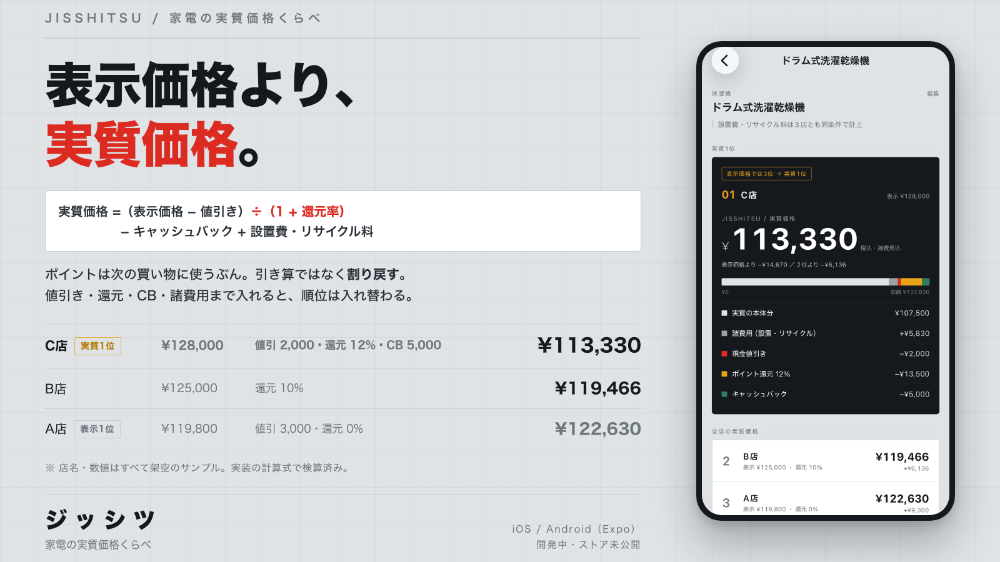

# ジッシツ — 家電の実質価格くらべ

家電の値引き・ポイント還元・キャッシュバック・諸費用をまとめて計算し、
**表示価格ではなく実質価格**で店舗を比較するアプリのコンセプト。

```text
実質価格 =（表示価格 − 現金値引き）÷（1 + ポイント還元率）− キャッシュバック + 設置費・リサイクル料
```

ポイントは次回購入に使うものなので、`表示価格 ×（1 − 還元率）` という単純な引き算は
安く見積もりすぎる誤りになる。20%還元の10万円の商品は「8万円」ではなく
`10万 ÷ 1.2 ≒ 83,333円` が正しい実質価格。



**画像内の店名・価格はすべて架空のサンプルです。** 実在の店舗の価格情報ではありません。

端末に写っている画面は、実装をiOSシミュレータで動かした実際のスクリーンショットです
（2026-08-04 更新）。アプリはまだストアで公開していません。
