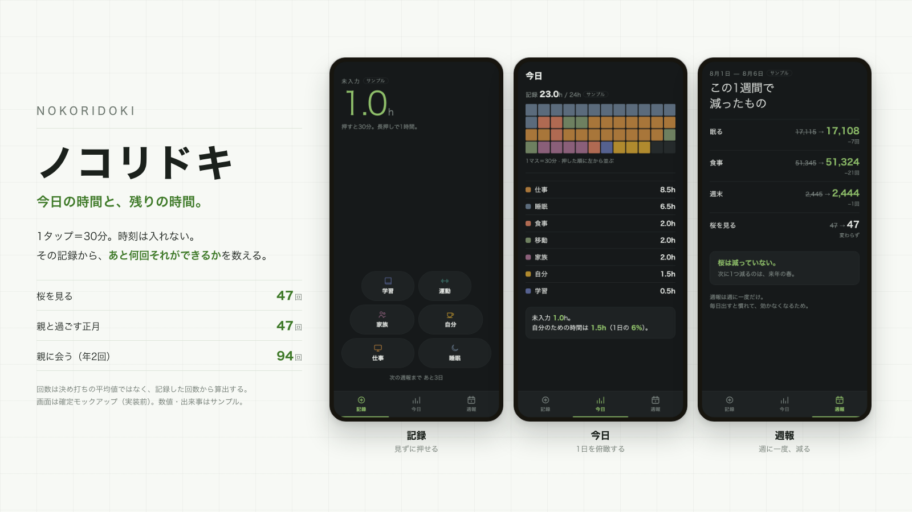

# ノコリドキ — 今日の時間と、残りの時間。

今日1日を**テキスト入力なし・アイコンのタップだけ**で記録し、その記録から
**「あと何回それができるか」**を数えるスマホアプリのコンセプト。

```text
1タップ ＝ 30分   長押し ＝ 1時間   時刻は指定しない
```



## 3つの画面

| 画面 | 役割 |
|---|---|
| 記録 | 親指の届く弧にボタンを置き、**画面を見ないで押せる**ことに全振り |
| 今日 | 48マスの積み上げビューで1日を俯瞰する |
| 週報 | **週に一度だけ**「残り回数がいくつ減ったか」を前後の数字で見せる |

## 数値について

**画像内の数値・出来事はすべて架空のサンプルです。**

残り回数は決め打ちの平均値ではなく、**ユーザーが記録した回数から算出する**設計にしています。
記録が貯まるまでは日次の回数を表示しません。

**画面は確定モックアップ（2026-08-06時点）で、まだ実装していません。**
ライト／ダーク両テーマに対応する予定で、画像に写っているのはダークテーマです。
